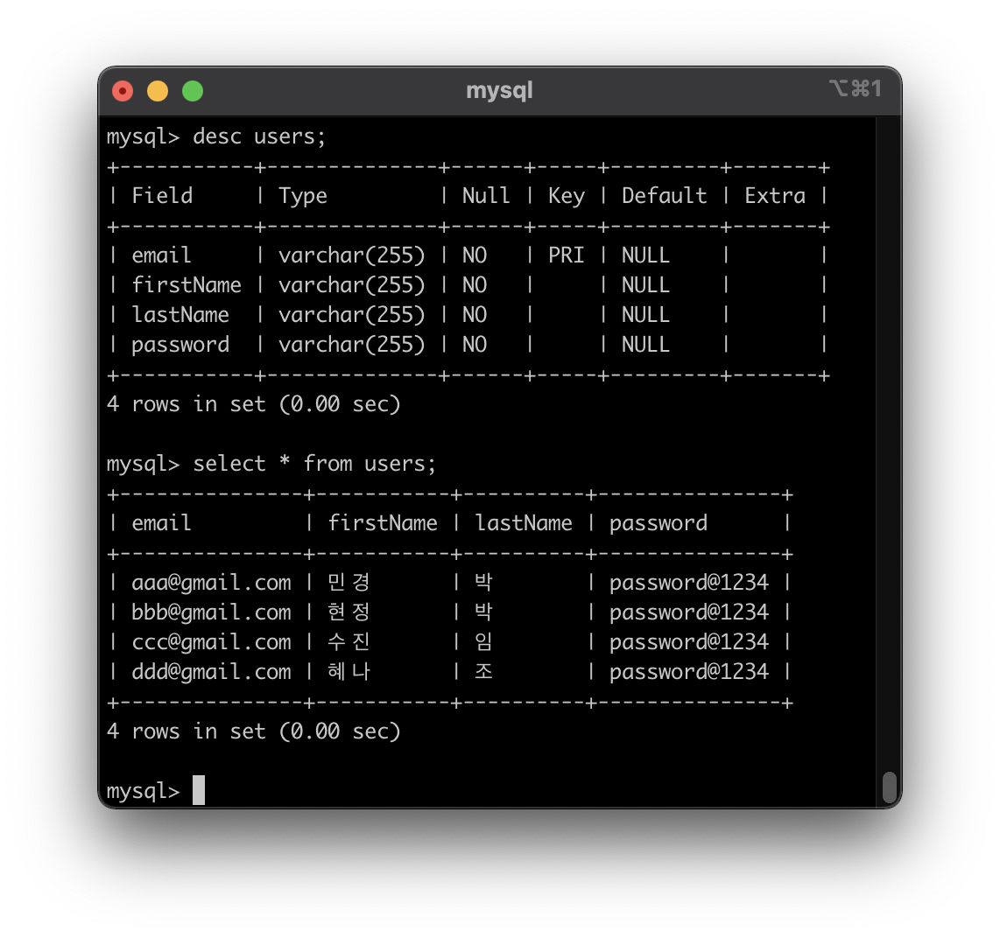

# ts-board-api
board api using [ nodejs(express), typescript, typeORM ]
<br>
<br>

## Structure And Config
```bash
├── ts-board-api/
    ├── src/                           : ts files run by ts-node
        ├── controllers/               : business logic module - index, post, user
        │   ├── index.controller.ts     // root route
        │   ├── user.controller.ts      // user route
        │   └── post.controller.ts      // post route
        ├── entity/
        │   ├── Post.ts                 // Post Table
        │   ├── User.ts                 // User Table
        │   └── ValidationEntity.ts     // For Validation
        ├── app.ts                     : Route & Middleware setting
        ├── server.ts                  : DB Connection & Errorhandler setting and Root Server File
        ├── ormconfig.json             : typeorm Config
        ├── package.json               : npm dependency Cofig
        └── tsconfig.json              : typescript Config
```
<br>

## Middleware
+ body-parser, cookie-parser
+ errorhandler
+ class-validator, isemail
+ jsonwebtoken
+ reflect-metadata
<br>

## DB Table
- table -> entity (mysql + typeorm)

#### db schema
+ tables

<br>

+ user Table


+ posts Table


+ users : posts => 1 : N 관계 (foregin key - `email` column)
<br>

- Relation in typeorm
``` bash
User entity -> Post entity @OneToMany
Post entity -> User entity @ManyToOne, @JoinColum({name:"user_id"})
```
<br>

## Server API Docs
- user api

|method|API|설명|
|:---|:---|:---|
|GET/|"/"| root route, 로그인이 되어 있으면 유저 이름과 함께 Hello메세지 아니면 "No Account please login.." 반환|
|GET/|"/user" | 모든 유저 조회 |
|GET/|"/user/:id" | 이메일로 유저 조회 |
|PUT/|"/user/:id" | 이메일에 해당하는 유저 정보 수정, 로그인이 되어 있고 본인 일때만 수정 가능 |
|DELETE/|"/user/:id" | 이메일에 해당하는 유저 삭제, 로그인이 되어 있고 본인 일때만 삭제 가능|
|POST/|"/user/login" | 로그인 |
|GET/| "/user/logout" | 로그아웃 |
|GET/| "/user/signup" | 회원가입 class-validator로 유효검사 |

<br>

- post api

|method|API|설명|
|:---|:---|:---|
|GET/| "/post" | 모든 게시글 조회 |
|GET/| "/post/mypost" | 본인 게시글만 조회 |
|POST/| "/post" | 게시글 작성, 로그인 된 상태에서만 class-validator로 유효검사 |
|GET/| "/post/:id" | 게시글 번호로 조회 |
|PUT/| "/post/:id" | 게시글 번호로 수정, 로그인이 되어 있고 본인이 작성한 글일 때만 수정가능 |
|DELETE/| "/post/:id" | 게시글 번호로 삭제, 로그인이 되어 있고 본인이 작성한 글일 때만 삭제가능 |
|GET/| "post/search/:keword" | 제목 또는 본문 내용 검색 |

<br>

#### 실행화면
- /user


- /post


<br>

## Build set up
```bash
$ git clone https://github.com/minkyungpark/ts-board-api
$ cd ts-board-api
$ npm install
$ npm start run
```